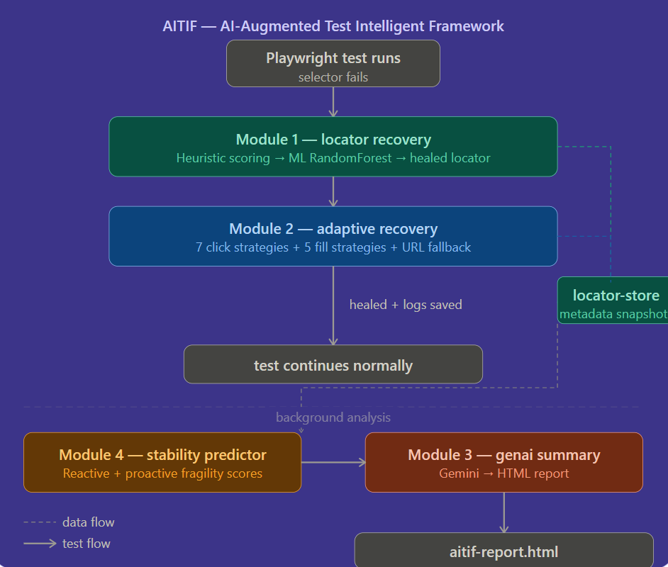
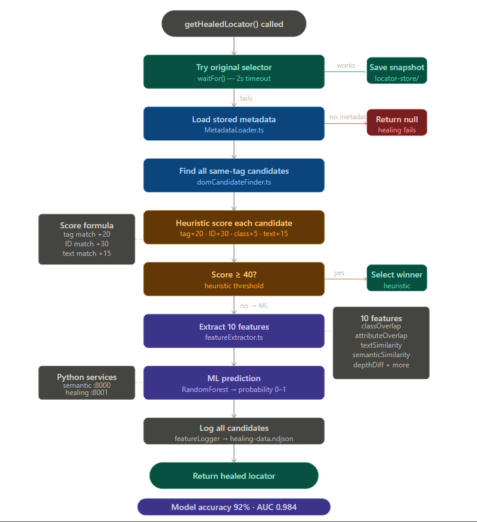

# AITIF — AI-Augmented Test Intelligent Framework

> A self-healing test automation framework that automatically fixes broken locators, recovers from interaction failures, predicts which elements will break next, and generates AI-powered health reports — all without manual intervention.

---

## What is AITIF?

Most test frameworks tell you a test failed. **AITIF tells you why it's going to fail before it does, fixes it automatically, and explains everything in plain English.**

Built on top of Playwright, AITIF adds an intelligent recovery layer that keeps your test suite running even as your application evolves. When a selector breaks because a developer renamed a class or removed an ID, AITIF finds the correct element using a combination of heuristic scoring and a trained RandomForest model — transparently, without touching your test code.

---

## The Problem

Component-based web applications (React, Angular, Vue) cause DOM changes constantly during development. Class names get renamed. IDs get removed. `data-test` attributes get refactored. Every change is a potential test failure — not because the application is broken, but because the test's selector no longer matches.

This is known as **locator brittleness**, and it's one of the primary sources of false-negative failures in CI pipelines. Teams spend significant time maintaining selectors instead of writing meaningful tests.

---

## The Solution — 4 Modules

```

```

---

## Module 1 — Locator Recovery

When a test selector fails to find an element, the locator recovery module kicks in automatically.

**How it works:**

1. **Metadata collection** — During healthy test runs, AITIF snapshots every element's DOM metadata (tag, ID, classes, attributes, text, depth, siblings) and saves it locally.
2. **Heuristic scoring** — When a selector fails, all same-tag elements on the page are scored against the snapshot using a weighted formula (tag +20, ID +30, class overlap +5 each, text match +15). A score ≥ 40 selects the element directly.
3. **ML fallback** — When no candidate scores ≥ 40 (the hard cases), a trained RandomForest classifier predicts the correct element using a 10-dimensional feature vector including textual similarity, semantic similarity via sentence embeddings, and DOM structural signals.

**Model performance:**

| Metric | Value |
|--------|-------|
| Test accuracy | **92.0%** |
| AUC-ROC | **0.984** |
| Average Precision | **0.974** |
| Training samples | 2,925 |
| Cross-validation (5-fold) | 0.877 ± 0.060 |

**Usage:**
```typescript
import { getHealedLocator } from "./modules/locator-recovery/healer/healingExecutor";

// Replace locator.click() with:
const healed = await getHealedLocator(page, "#login-button", "login_button");
await healed?.click();
```

---

## Module 2 — Adaptive Recovery

When the correct element is found but the interaction itself fails (element invisible, covered by overlay, pointer-events disabled, input readonly), adaptive recovery tries a ladder of strategies automatically.

**Click strategy ladder:**
1. `normal_click` — standard Playwright click
2. `scroll_then_click` — scroll into view first
3. `dismiss_overlay_then_click` — close any modal/banner blocking it
4. `hover_then_click` — trigger CSS hover state first
5. `keyboard_enter` — focus and press Enter
6. `js_click` — JavaScript native dispatch (bypasses pointer-events)
7. `force_click` — last resort, bypasses all visibility checks

**Fill strategy ladder:**
1. `normal_fill` — standard Playwright fill
2. `js_value_set` — React-safe native setter + synthetic events
3. `clear_then_fill` — triple-click to clear, then type
4. `slow_type` — character by character (removes readonly first)
5. `clipboard_paste` — write to clipboard and paste

**Smart URL fallback** — during healthy runs, AITIF records which URL each action navigates to. If all click strategies fail (genuine bug), it navigates directly to the recorded URL.

**Usage:**
```typescript
import { adaptiveClick, adaptiveFill } from "./modules/adaptive-recovery/executor/adaptiveExecutor";

// Replace locator.click() with:
await adaptiveClick(page, locator, "login_button");

// Replace locator.fill() with:
await adaptiveFill(page, locator, "username_input", "standard_user");
```

---

## Module 3 — GenAI Summary

Reads the output from all three other modules and uses Google Gemini to generate a human-readable health report.

**Two audiences, one report:**

- **For Everyone** — plain English summary for managers and stakeholders. No technical jargon. Explains what the system fixed, what needs attention, and what action to take.
- **For Developers** — technical analysis with specific locator names, fragility scores, healing frequency, and concrete recommendations (e.g. "add `data-test` attribute to `checkout_firstname`").

**Full locator table** — all analysed elements with colour-coded risk levels, heal counts, recovery counts, DOM signals, and recommendations. Filterable by risk level.

**Usage:**
```bash
npx ts-node modules/genai-summary/index.ts
# Opens: data/genai-reports/aitif-report.html
```

---

## Module 4 — Stability Predictor

Analyses every locator across two dimensions and produces a fragility score 0–100.

**Reactive signals (history-based, max 50 pts):**
- How many times was it healed by ML?
- How many adaptive recovery workarounds were needed?
- Did it suffer full attribute drift (worst-case breakage)?

**Proactive signals (DOM analysis, max 50 pts):**
- Missing `data-test` attribute (+15) — most stable identifier absent
- Missing ID (+10)
- More than 3 CSS classes (+8) — many breakpoints
- DOM depth > 8 (+8) — deep nesting is fragile
- Text content > 30 chars (+5) — copy changes break it
- Positional selection (+4) — breaks on reorder

**Risk levels:**

| Score | Level | Action |
|-------|-------|--------|
| 0–25 | 🟢 STABLE | No action needed |
| 26–50 | 🟡 WATCH | Monitor, consider adding `data-test` |
| 51–75 | 🟠 FRAGILE | Refactor recommended |
| 76–100 | 🔴 CRITICAL | Fix urgently |

**Usage:**
```bash
npx ts-node modules/stability-predictor/index.ts
# Output: data/stability-reports/stability-report.json
```

---

## Project Structure

```
AITIF/
├── core/
│   ├── logger/              # Pino logger
│   ├── ml/                  # healingClient, semanticClient
│   └── types/               # LocatorMetadata types
├── modules/
│   ├── locator-recovery/
│   │   ├── collector/       # LocatorCollector.ts
│   │   ├── healer/          # healingExecutor.ts
│   │   ├── matcher/         # domCandidateFinder, MetadataLoader
│   │   ├── ml/              # featureExtractor, featureLogger
│   │   └── scorer/          # similarityScorer, selectBestCandidate
│   ├── adaptive-recovery/
│   │   ├── core/            # ActionResult, RecoveryContext types
│   │   ├── executor/        # adaptiveExecutor.ts
│   │   ├── logger/          # recoveryLogger.ts
│   │   └── strategies/      # clickStrategies, fillStrategies, navRecorder
│   ├── genai-summary/
│   │   ├── api/             # geminiClient.ts
│   │   ├── data/            # dataLoader.ts
│   │   ├── prompts/         # promptBuilder.ts
│   │   └── reporter/        # htmlReporter.ts
│   └── stability-predictor/
│       ├── analyzers/       # reactiveAnalyzer, proactiveAnalyzer
│       ├── core/            # StabilityTypes.ts
│       ├── reporter/        # stabilityReporter.ts
│       └── scorer/          # stabilityScorer.ts
├── python-services/
│   ├── semantic_service.py  # FastAPI — MiniLM sentence similarity (port 8000)
│   ├── healing_service.py   # FastAPI — RandomForest prediction (port 8001)
│   └── train_model.py       # Model training script
├── scripts/
│   └── exportDataset.ts     # Exports healing-data.ndjson → dataset.csv
├── tests/
│   ├── dataset-generation/  # Scripts to generate ML training data
│   └── sample/              # Example healing and recovery tests
└── data/                    # Generated at runtime (gitignored)
    ├── locator-store/        # Element metadata snapshots
    ├── ml-dataset/           # Training data
    ├── recovery-logs/        # Adaptive recovery history
    ├── stability-reports/    # Stability predictor output
    └── genai-reports/        # HTML reports
```

---

## Getting Started

### Prerequisites

```bash
node >= 18
python >= 3.9
```

### Installation

```bash
# Install Node dependencies
npm install

# Install Python dependencies
cd python-services
pip install fastapi uvicorn sentence-transformers scikit-learn joblib
```

### Environment Setup

Create a `.env` file in the project root:
```
GEMINI_API_KEY=your_key_here
```
Get a free key at [aistudio.google.com](https://aistudio.google.com) — no billing required.

---

## Running AITIF

### Step 1 — Start Python services
```bash
# Terminal 1 — Semantic similarity service
cd python-services
uvicorn semantic_service:app --port 8000

# Terminal 2 — ML healing service
uvicorn healing_service:app --port 8001
```

### Step 2 — Generate dataset (first time only)
```bash
npx playwright test --config=playwright.dataset.config.ts
npx ts-node scripts/exportDataset.ts
```

### Step 3 — Train the model (first time only)
```bash
cd python-services
python train_model.py
```

### Step 4 — Run healing tests
```bash
npx playwright test tests/sample/mlHealingTest.spec.ts
```

### Step 5 — Run stability predictor
```bash
npx ts-node modules/stability-predictor/index.ts
```

### Step 6 — Generate AI report
```bash
npx ts-node modules/genai-summary/index.ts
# Open: data/genai-reports/aitif-report.html
```

---

## Technical Stack

| Layer | Technology |
|-------|-----------|
| Test automation | Playwright (TypeScript) |
| ML classifier | RandomForest (scikit-learn) |
| Semantic similarity | all-MiniLM-L6-v2 (sentence-transformers) |
| ML services | FastAPI (Python) |
| AI report generation | Google Gemini 2.5 Flash |
| Logging | Pino |
| Runtime | Node.js + ts-node |

---

## Dataset

The training dataset was constructed using real web application elements from six publicly available demo applications:

| Site | Elements | Purpose |
|------|----------|---------|
| Saucedemo | Login, inventory, cart, checkout | Primary target app |
| DemoQA | Forms, tables, buttons, selects | Element type diversity |
| The Internet (Heroku) | Auth, dropdowns, dynamic elements | Edge cases |
| TodoMVC | Dynamic list items | Text-based healing |
| OrangeHRM | SPA navigation, dashboard | Enterprise app patterns |
| ExpandTesting | Login forms | Additional variety |

Five DOM mutation types simulate real-world refactoring patterns:

| Mutation | What breaks | Heuristic score after |
|----------|-------------|----------------------|
| `id_removed` | Element ID stripped | ≤ 35 → ML triggered |
| `class_renamed` | Classes suffixed `-v2` | ≤ 35 → ML triggered |
| `attr_changed` | `data-test` values changed | ≤ 35 → ML triggered |
| `id_and_class` | Both ID and classes removed | ≤ 20 → ML triggered |
| `full_drift` | All identifiers removed | ≤ 20 → ML triggered |

**2,925 training records** — 1 positive + 2 hard negatives per mutation, balanced 1:2 ratio.

---

## Known Limitations

- `tagMatch` and `idMatch` features have zero variance in the current dataset and are excluded from model training
- `parentMatch` feature contains a known implementation issue (compares `original.tag` vs `candidate.parentTag` instead of parent-to-parent)
- Reactive stability scores are inflated by intentional dataset generation heals — production scores will be more accurate
- Proactive stability prediction uses rule-based heuristics; ML-based proactive prediction is planned as future work requiring longitudinal data collection

---

## Future Work

- Fix `parentMatch` bug and regenerate dataset for improved model accuracy
- Add `idMatch=1` training examples for better ID-based healing
- Implement ML-based proactive stability prediction using longitudinal locator snapshots
- Add Layer 2 adaptive recovery strategies using recorded network calls
- Integrate with CI/CD pipelines for automated health reports on every run
- Add support for mobile (Appium) and cross-browser healing

---

## License

MIT

---
## Author
Vanya

SDET | QA Engineer

*Built as a major academic project exploring the intersection of machine learning and test automation engineering.*